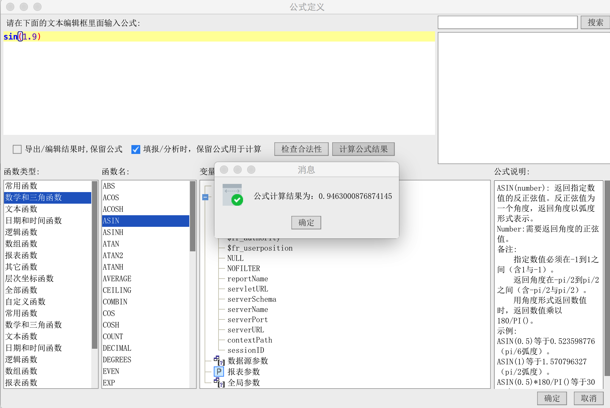

# 实时运算的公式编辑器插件
## 插件编译
将帆软报表安装目录下的相关jar包:

$installDir/fr-designer-core-8.0.jar

$installDir/fr-designer-chart-8.0.jar

$installDir/fr-designer-report-8.0.jar

$installDir/WebReport/WEB-INF/lib/fr-core-8.0.jar

$installDir/WebReport/WEB-INF/lib/fr-chart-8.0.jar

$installDir/WebReport/WEB-INF/lib/fr-report-8.0.jar

$installDir/WebReport/WEB-INF/lib/fr-platform-8.0.jar

$installDir/WebReport/WEB-INF/lib/fr-third-8.0.jar

拷贝到项目工程的lib/report目录下（如果没有该目录则自行新建）

然后执行ant命名来编辑插件包：

`ant -f build.xml jar`

## 插件安装
使用帆软设计器自带的插件管理器即可安装。

## 插件使用
对于部分公式可以直接查看计算结果：


## 实现相关概述

公式编辑器面板需要实现接口

```
com.fr.design.formula.UIFormula
```

注册新的公式编辑器需要实现接口

```
com.fr.design.fun.UIFormulaProcessor
```

plugin.xml注册节点

```xml
 <extra-designer>
      <UIFormulaProcessor class="com.fr.plugin.designer.formula.ActualFormulaUI"/>
 </extra-designer>
```

## 接口内容

com.fr.design.formula.UIFormula

```java
package com.fr.design.formula;

import com.fr.base.Formula;
import com.fr.design.dialog.BasicDialog;
import com.fr.design.dialog.DialogActionListener;

import java.awt.*;

/**
 * @author richie
 * @date 2015-06-24
 * @since 8.0
 */
public interface UIFormula {

    /**
     * 从已有的公式还原公式面板
     * @param formula 公式
     */
    void populate(Formula formula);

    /**
     * 根据指定的变量处理和公式还原公式面板
     * @param formula 公式
     * @param variableResolver 变量处理器
     */
    void populate(Formula formula, VariableResolver variableResolver);

    /**
     * 获取公式面板的参数
     * @return 公式
     */
    Formula update();

    /**
     * 显示窗口
     * @param window 窗口
     * @param l 对话框监听器
     * @return 对话框
     */
    BasicDialog showLargeWindow(Window window, DialogActionListener l);
}
```
_____
com.fr.design.fun.UIFormulaProcessor

```java
public interface UIFormulaProcessor extends Immutable{
    String MARK_STRING = "UIFormulaProcessor";

    int CURRENT_LEVEL = 1;


    /**
     * 普通的公式编辑器界面类
     * @return 公式编辑器界面类
     */
    UIFormula appearanceFormula();

    /**
     * 当需要显示“保留公式”项时的公式编辑器界面类
     * @return 公式编辑器界面类
     */
    UIFormula appearanceWhenReserveFormula();
}
```